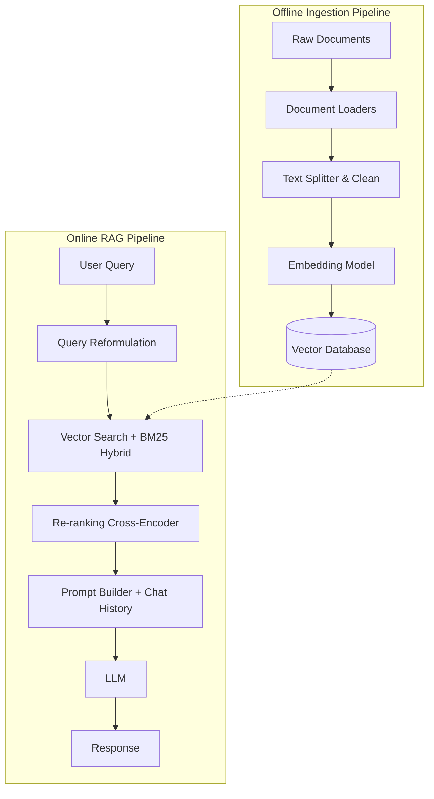

# Tài liệu Thiết kế Dự án Chi tiết: Hệ thống RAG Chatbot

## 1. Tổng quan dự án (Project Overview)
Dự án hướng tới việc xây dựng một hệ thống RAG (Retrieval-Augmented Generation) cấp độ production. Hệ thống không chỉ trả lời câu hỏi dựa trên dữ liệu tĩnh mà còn phải đảm bảo tính mở rộng, khả năng truy xuất chính xác cao và tích hợp quy trình kiểm thử tự động.

### 1.1. Mục tiêu (Objectives)
- Xử lý đa dạng định dạng tài liệu đầu vào (PDF, Markdown, HTML, TXT).
- Giảm thiểu tối đa hiện tượng Hallucination (ảo giác) của LLM.
- Thời gian phản hồi (Latency) cho mỗi luồng truy vấn < 3 giây.
- Hỗ trợ ngữ cảnh hội thoại (Chat History) để có thể hỏi đáp nối tiếp.

### 1.2. Phạm vi (Scope)
- **In-scope:** Xây dựng API backend xử lý logic RAG, Vector DB, module tích hợp dữ liệu (Ingestion module), và giao diện UI cơ bản.
- **Out-of-scope:** Tự fine-tune LLM model (chỉ sử dụng LLM qua API).

---

## 2. Kiến trúc Hệ thống (System Architecture)

Kiến trúc được chia thành hai luồng chính: **Offline (Nạp dữ liệu)** và **Online (Truy vấn theo thời gian thực)**.



---

## 3. Lựa chọn Công nghệ (Tech Stack)

| Lớp (Layer) | Công cụ đề xuất | Lý do lựa chọn |
| :--- | :--- | :--- |
| **Ngôn ngữ & Framework** | Python 3.10+, FastAPI, LlamaIndex/LangChain | FastAPI cho API hiệu năng cao, LlamaIndex mạnh mẽ cho Data framework. |
| **Document Loaders** | Unstructured, PyMuPDF | Trích xuất text tốt nhất cho PDF, giữ nguyên cấu trúc bảng biểu. |
| **Embedding Model** | `text-embedding-3-small` (OpenAI) hoặc `BAAI/bge-m3` | Hỗ trợ đa ngôn ngữ (đặc biệt là tiếng Việt), tốc độ nhúng nhanh. |
| **Vector Database** | Qdrant hoặc Milvus | Hỗ trợ Hybrid Search (Dense + Sparse vector) tốt hơn ChromaDB. |
| **Re-ranking** | `bge-reranker-large` hoặc Cohere Rerank API | Tăng độ chính xác của Top-K document được truy xuất. |
| **LLM** | GPT-4o-mini hoặc Claude 3.5 Haiku | Tối ưu giữa chi phí, tốc độ và khả năng suy luận logic. |

---

## 4. Chi tiết Quy trình Nạp dữ liệu (Data Ingestion Pipeline)

### 4.1. Tiền xử lý (Preprocessing)
- Loại bỏ các ký tự ẩn, chuẩn hóa unicode.
- Trích xuất Metadata quan trọng (Tác giả, Ngày tạo, Tên file, Category) để hỗ trợ **Metadata Filtering** khi tìm kiếm.

### 4.2. Chiến lược Chunking Nâng cao
Thay vì chỉ cắt theo số lượng từ (Fixed-size), dự án sẽ kết hợp:
- **Semantic Chunking:** Cắt theo ý nghĩa câu/đoạn (sử dụng NLTK hoặc spacy).
- **Parent-Child Chunking:** Lưu các chunk nhỏ (Child) để lấy embedding cho chính xác, nhưng khi LLM cần context thì sẽ trả về chunk lớn hơn (Parent) bao quanh chunk nhỏ đó để giữ trọn vẹn ngữ cảnh.

---

## 5. Chi tiết Quy trình Truy vấn (Advanced Retrieval Pipeline)

Để đảm bảo kết quả truy xuất tốt nhất, luồng truy xuất không chỉ dùng Vector Search cơ bản:

1. **Query Transformation:**
   - Dùng một LLM nhỏ để viết lại câu hỏi của người dùng (Query Rewriting) cho rõ nghĩa hơn.
   - Nếu câu hỏi yêu cầu ngữ cảnh cũ, kết hợp *Chat History* để tạo ra một câu hỏi độc lập (Standalone Query).
2. **Hybrid Search:**
   - Kết hợp **Vector Search** (tìm ý nghĩa ngữ nghĩa) và **Keyword Search (BM25)** (tìm chính xác từ khóa, mã lỗi, tên riêng).
3. **Re-ranking (Sắp xếp lại):**
   - Hybrid search trả về Top 20 tài liệu. Đưa 20 tài liệu này qua mô hình Cross-Encoder (Reranker) để chấm điểm lại mức độ liên quan và chỉ lấy Top 5 tài liệu đưa vào LLM.

---

## 6. Prompt Engineering & Quản lý Bộ nhớ (Memory)

### 6.1. System Prompt
```text
Bạn là chuyên gia kỹ thuật hỗ trợ dự án. Nhiệm vụ của bạn là trả lời câu hỏi dựa TRÊN CÁC TÀI LIỆU được cung cấp dưới đây.

RÀNG BUỘC:
1. NẾU thông tin KHÔNG có trong tài liệu, hãy trả lời chính xác: "Dữ liệu hiện tại không chứa thông tin này." Không tự suy diễn.
2. Trích dẫn nguồn (tên file hoặc số trang) sau mỗi luận điểm nếu có.
3. Trình bày bằng Markdown, sử dụng bullet points để dễ đọc.

---
TÀI LIỆU TRUY XUẤT:
{context}

---
LỊCH SỬ TRÒ CHUYỆN:
{chat_history}

---
CÂU HỎI HIỆN TẠI: {question}
```

---

## 7. Đảm bảo chất lượng & Kiểm thử tự động (LLMOps & Testing)

Để đưa vào môi trường thực tế, hệ thống cần có cơ chế kiểm thử tự động cho 파 pipelnie AI:

- **Khung đánh giá:** Tích hợp **RAGAS** hoặc **TruLens** vào quy trình CI/CD.
- **Các metric cần đo đạc:**
  - *Context Precision:* Đo lường xem tài liệu truy xuất có thực sự giải quyết được câu hỏi không.
  - *Context Recall:* Hệ thống có lấy sót thông tin quan trọng trong Database không.
  - *Faithfulness:* Output của LLM có bịa đặt (hallucinate) so với context được cấp hay không.
- **Tự động hóa:** Thiết lập script Python chạy bộ test case (ground truth dataset) mỗi khi có thay đổi về thuật toán chunking hoặc đổi mô hình embedding.

---

## 8. Triển khai (Deployment)

- **Backend Containerization:** Đóng gói FastAPI backend bằng Docker.
- **CI/CD:** Sử dụng GitHub Actions để tự động build image và chạy các bài test RAGAS.
- **Monitoring:** Theo dõi token usage, latency và lưu lại các câu hỏi bị LLM trả lời "Không biết" để bổ sung thêm dữ liệu (Data Flywheel).