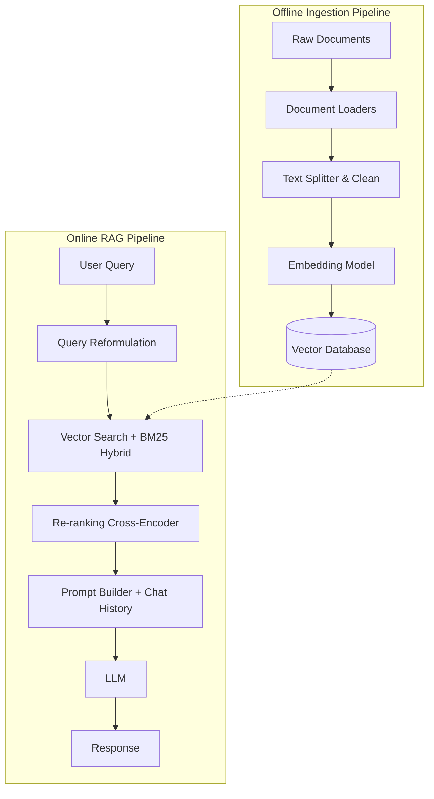

# Detailed Project Design: RAG Chatbot System

## 1. Project Overview
This project aims to build a production-grade RAG (Retrieval-Augmented Generation) system. The system not only answers questions based on static data but also ensures scalability, high retrieval accuracy, and integration of automated testing pipelines.

### 1.1. Objectives
- Handle multiple document input formats (PDF, Markdown, HTML, TXT).
- Minimize LLM hallucination as much as possible.
- Response latency per query pipeline < 3 seconds.
- Support conversational context (Chat History) for follow-up Q&A.

### 1.2. Scope
- **In-scope:** Build backend API handling RAG logic, Vector DB, data ingestion module, and a basic UI.
- **Out-of-scope:** Self fine-tuning LLM models (uses LLM via API only).

---

## 2. System Architecture

The architecture is divided into two main pipelines: **Offline (Data Ingestion)** and **Online (Real-time Query)**.



---

## 3. Tech Stack

| Layer | Recommended Tool | Rationale |
| :--- | :--- | :--- |
| **Language & Framework** | Python 3.10+, FastAPI, LlamaIndex/LangChain | FastAPI for high-performance APIs, LlamaIndex as a powerful data framework. |
| **Document Loaders** | Unstructured, PyMuPDF | Best text extraction from PDFs, preserves table structures. |
| **Embedding Model** | `text-embedding-3-small` (OpenAI) or `BAAI/bge-m3` | Multilingual support (especially Vietnamese), fast embedding speed. |
| **Vector Database** | Qdrant or Milvus | Supports Hybrid Search (Dense + Sparse vectors) better than ChromaDB. |
| **Re-ranking** | `bge-reranker-large` or Cohere Rerank API | Increases retrieval accuracy of Top-K documents. |
| **LLM** | GPT-4o-mini or Claude 3.5 Haiku | Optimal balance of cost, speed, and reasoning capability. |

---

## 4. Data Ingestion Pipeline Detail

### 4.1. Preprocessing
- Remove hidden characters, normalize unicode.
- Extract key metadata (Author, Creation Date, File Name, Category) to support **Metadata Filtering** during search.

### 4.2. Advanced Chunking Strategy
Instead of only fixed-size splitting, the project combines:
- **Semantic Chunking:** Split by sentence/paragraph meaning (using NLTK or spaCy).
- **Parent-Child Chunking:** Store small chunks (Child) for accurate embedding, but when the LLM needs context, return a larger chunk (Parent) surrounding the child to preserve full context.

---

## 5. Advanced Retrieval Pipeline Detail

To ensure the best retrieval results, the pipeline goes beyond basic vector search:

1. **Query Transformation:**
   - Uses a lightweight LLM to rewrite the user's question (Query Rewriting) for better clarity.
   - If the question requires prior context, combines *Chat History* to generate a standalone query.
2. **Hybrid Search:**
   - Combines **Vector Search** (semantic meaning search) and **Keyword Search (BM25)** (exact keyword, error codes, proper names).
3. **Re-ranking:**
   - Hybrid search returns the Top 20 documents. Pass these 20 documents through a Cross-Encoder (Reranker) to re-score relevance and take only the Top 5 documents to feed into the LLM.

---

## 6. Prompt Engineering & Memory Management

### 6.1. System Prompt
```text
You are a technical expert assisting the project. Your task is to answer questions based SOLELY ON THE DOCUMENTS provided below.

CONSTRAINTS:
1. IF the information is NOT in the documents, respond exactly: "The current data does not contain this information." Do not speculate.
2. Cite sources (file name or page number) after each point if available.
3. Format using Markdown, use bullet points for readability.

---
RETRIEVED DOCUMENTS:
{context}

---
CHAT HISTORY:
{chat_history}

---
CURRENT QUESTION: {question}
```

---

## 7. Quality Assurance & Automated Testing (LLMOps)

To deploy in a real environment, the system needs automated AI pipeline testing:

- **Evaluation Framework:** Integrate **RAGAS** or **TruLens** into the CI/CD pipeline.
- **Metrics to measure:**
  - *Context Precision:* Measures whether the retrieved documents actually answer the question.
  - *Context Recall:* Whether the system missed important information in the database.
  - *Faithfulness:* Whether the LLM output hallucinates relative to the provided context.
- **Automation:** Set up a Python script to run test cases (ground truth dataset) whenever there are changes to the chunking algorithm or embedding model swap.

---

## 8. Deployment

- **Backend Containerization:** Package the FastAPI backend using Docker.
- **CI/CD:** Use GitHub Actions to automatically build images and run RAGAS tests.
- **Monitoring:** Track token usage, latency, and log questions that the LLM answers with "Unknown" to supplement additional data (Data Flywheel).
